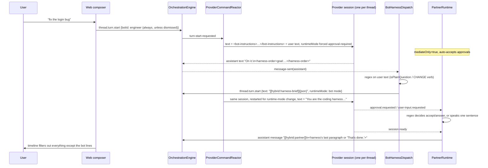
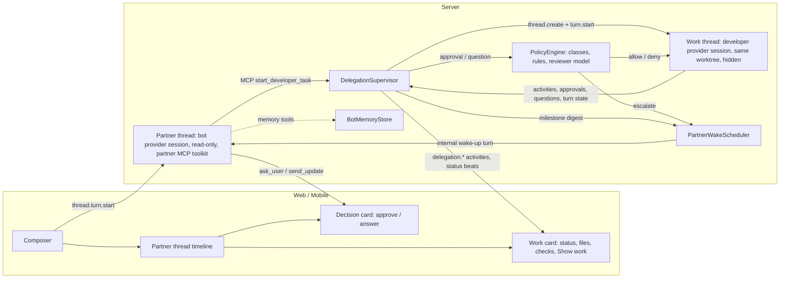

# Hybrid — Audit, Rethink, and Rebuild Plan

Date: 2026-10-03
Scope: `<workspace>/app` (Hybrid, T3 Code fork), compared against `<workspace>/refs/open-dot` and `<workspace>/refs/akeru-bot`, with `<workspace>/refs/t3code` as the upstream baseline.
Rule for this document: no code was changed. Everything below is what I would change, and how I would do it.

---

## Status (updated 2026-10-08)

Read this first. The audit below is kept as written on 2026-10-03; where the plan changed since, the change is noted inline with **Update (2026-10-08)**.

**Shipped (all on `main` in `app/`, tagged, pushed to `origin`):**

| Version | What                                                                                                                                                                                                                                                                                                                     |
| ------- | ------------------------------------------------------------------------------------------------------------------------------------------------------------------------------------------------------------------------------------------------------------------------------------------------------------------------ |
| v0.1.0  | Phases 0-6 and most of 7: partner/developer split (§5), partner MCP toolkit, DelegationSupervisor, work cards and live status, wake-ups, PolicyEngine with decision and plan cards, notifications, old `[[hybrid:…]]` protocol deleted, Hatch v2 and bot settings v2, Developer directly restores git/terminal controls. |
| v0.1.1  | Always-allow matches per command part (not whole chained lines); `projection_thread_bots` replaces the used-bots full scan (F3); bot list updates live from `bots.subscribe` (H4).                                                                                                                                       |
| v0.1.2  | Commit messages and other non-path quoted text no longer classify as secrets / production / delete / send.                                                                                                                                                                                                               |
| v0.1.3  | Wrapped (`env`, `sudo`, `xargs`, `eval`, …), remote (`ssh`/`scp`/`rsync host:`), and inline-code (`python -c`, `node -e`, …) commands no longer auto-allow; new approval class `opaque` always asks.                                                                                                                     |

**In progress: v0.2.0, one bot and the Hybrid icon** (branch `hybrid/v0.2.0`, decided 2026-10-08, see §9):

- The app ships with **exactly one associate, "Hybrid"**: the built-in Engineer renamed and recoloured to the brand face (`brand/hybrid-bot.svg`), with the same `BotId`, so existing threads keep working. Its instructions absorb the specialists' jobs: answer questions by reading code, review a diff on request, and propose plans via the plan card.
- Research, Reviewer, and Planner are **archived** (soft delete). Old threads still render their faces from bot snapshots.
- **Hatch and custom bots are hidden** behind a single flag (`HYBRID_MULTI_BOT`, off). The code stays and the server rejects new bots while the flag is off. "Talk to" offers only Hybrid or **Developer directly**.
- The app icon (all channels, web, splash, mobile) comes from `brand/hybrid-bot-app-icon.svg`.

**Deferred (not in v0.2.0):** bot memory (§5.11), `consult_bot` and specialists (Phase 8; revisit only if the one-bot experience needs it), free-text policy-rule reviewer (built, off by default to save usage), mobile work and decision cards, upstream-drift check, composer motion (H2), and the live conversation checklist (§7.9), which needs one session on a real model before any public release.

**Known test failures:** `app/docs/hybrid/KNOWN_TEST_FAILURES.md` (the only copy).

---

## 0. The short version

**The idea is good. The engine under it is wrong, and patching it will not get you the experience you want.**

What you described ("I talk to my associate in plain words, the associate drives the harness, keeps me updated, and only bothers me when a decision is actually mine") is a strong product. Open Dot and Akeru both prove parts of it work. But Hybrid today implements it as:

1. **One provider session wearing two hats.** The same Codex or Claude conversation is the "partner" on one turn and the "harness" on the next. The partner's instructions are pasted into the user's message text every turn, and the harness is told "you are the coding harness" in the same conversation that was just told "do not edit files".
2. **A text-tag protocol.** The bot has to end its reply with a `<harness-order>` block. The server finds it with `indexOf`, then writes a `[[hybrid:harness-brief]]{json}` fake user message to start the harness. The UI then hides rows by scanning for those strings.
3. **Regex intent detection.** Whether the developer is allowed to run is decided by a regex over the user's last message (`add|create|fix|…`). "Yes, go ahead", "ship it", "do it", and any non-English message never reach the developer.
4. **A mediator that approves almost everything.** `PartnerRuntime` auto-accepts nearly every harness approval, _including approvals requested during the "read-only" partner turn_. So a read-only bot can edit your files.
5. **No narration.** The one thing that makes this feel like an associate (it tells you what it is doing and what it found) does not exist. You get "Engineer is on it.." and then, minutes later, either the harness's raw last paragraph or "That's done."
6. **Hidden questions can deadlock the turn.** When the harness is blocked on an approval and the bot asks you in a sentence, your reply is queued by the composer and never sent, because the queue is blocked by the same approval you can no longer see.

On top of that: state is in-memory and global, there is no way to talk to the plain harness anymore (every message silently goes to `@engineer`), the web app does not typecheck, mobile shows raw protocol text, and a 2,443-file uncommitted rebrand makes every future upstream merge painful.

**My recommendation:** keep the parts that are fine (bot registry, bot snapshot on messages, the presence UI, the "Hatch is a conversation" idea, the "harness work is private by default" idea), and **replace the turn engine** with the design in §5. In one sentence:

> The bot is a real agent with real tools, running read-only in its own conversation. To change code it starts a **developer task**: a hidden child thread on the same worktree. A server-side supervisor watches that task, answers routine approvals by your rules, streams a live status line, and wakes the bot at milestones so it can tell you, in its own voice, what happened and what it needs from you.

That is the Akeru delegation pattern plus Open Dot's activity, card, and rules patterns, built on T3's existing MCP server and child-thread machinery.

---

## 1. What I looked at and what I ran

### Read

- Every Hybrid-specific file: `apps/server/src/bots/*`, `apps/server/src/orchestration/BotHarnessDispatch.ts`, `packages/contracts/src/{bots,harnessOrder,partnerVoice}.ts`, `apps/web/src/bots/*`, migrations `055`/`056`.
- Every `// HYBRID` hook into upstream code, diffed against `refs/t3code`: `ProviderCommandReactor`, `OrchestrationEngine`, `OrchestrationReactor`, `decider`, `projector`, `ProjectionPipeline`, `ProjectionSnapshotQuery`, `ProjectionThreadMessages`, `server.ts`, `ws.ts`, `rpc.ts`, `RpcAuthorization`, `runtimeLayer`, all `*TextGeneration.ts`, `ChatView`, `ChatComposer`, `MessagesTimeline(.logic)`, `ChatHeader`, `Sidebar`, `threadReducer`.
- Plans: `plans/PLAN.md`, `plans/EXECUTION.md`, `app/docs/seams.md`.
- Open Dot: `server/agent/{runtime,prompt,tools,review}.ts`, `lib/types.ts`, `server/db.ts`, `server/repo.ts`, `server/bus.ts`, `components/{Chat,NewDot}.tsx`, README.
- Akeru: `contracts/{akeruDelegation,akeruTools}.ts`, `provider/{AkeruDelegationRuntime,AkeruAgentInstructions,AkeruMastraTools}.ts`, `provider/Layers/AgentController.ts` (delegation wiring), `bot-inbox/service.ts`, `OrchestrationBot` schema, docs `memory.md`, `channels.md`, `work-artifacts.md`.
- T3 infrastructure that matters for the fix: `mcp/McpHttpServer.ts`, `mcp/McpInvocationContext.ts`, `mcp/toolkits/pullRequests/tools.ts`, `provider/RuntimeInstructions.ts`, Codex/Claude MCP injection, `CodexSessionRuntime` runtime-mode mapping.

### Ran

| Check                                                                                   | Result                                                                                                                                                                                                                                                                                                                                                                                                                                                                                                       |
| --------------------------------------------------------------------------------------- | ------------------------------------------------------------------------------------------------------------------------------------------------------------------------------------------------------------------------------------------------------------------------------------------------------------------------------------------------------------------------------------------------------------------------------------------------------------------------------------------------------------ |
| `git status` in `app/`                                                                  | **2,443 uncommitted paths** at audit time, mostly the rebrand sweep. The partner runtime itself (`PartnerRuntime.ts`, `partnerDecide.ts`, `BotHarnessDispatch.ts`, `harnessOrder.ts`, `partnerVoice.ts`, Hatch, sidebar faces, and so on) was about 109 paths, mostly untracked. Migrations `055`/`056` were already committed. _Resolved in Phase 0: branch `hybrid/partner-v1-snapshot`, commits `98024cc4b` (rebrand), `80a7e5960` (partner runtime), `7f35d1ec1` (type fixes and pre-commit typecheck)._ |
| `tsc --noEmit` in `apps/server`                                                         | Pass.                                                                                                                                                                                                                                                                                                                                                                                                                                                                                                        |
| `tsc --noEmit` in `apps/web`                                                            | **Fail, 3 errors:** `ChatView.tsx(~8479)` and `ChatComposer.tsx(~6348)` pass `botId` as `string` where branded `BotId` is required. `MessagesTimeline.logic.test.ts(~4407)` references an undefined `TimelineEntry`. _Fixed in `7f35d1ec1`._                                                                                                                                                                                                                                                                 |
| `vp test run src/bots src/orchestration/Layers/ProviderCommandReactor.test.ts` (server) | 6 files, 88 tests pass.                                                                                                                                                                                                                                                                                                                                                                                                                                                                                      |
| `vp test run src/bots src/components/chat/MessagesTimeline.logic.test.ts` (web)         | 3 files, 141 tests pass.                                                                                                                                                                                                                                                                                                                                                                                                                                                                                     |

The tests pass, but they only cover pure helpers (regexes, parsers, row filtering). **There is no test for `PartnerRuntime`, `BotHarnessDispatch`, or the partner→harness→partner flow end to end**, which is where every serious bug below lives.

---

## 2. How Hybrid works today



The diagram makes the core problem visible. **The bot is not in the loop after it writes the order.** It never sees the harness's progress, never answers the harness's questions (regex does), never checks the result, and never writes the final message (the server pastes the harness's text in the bot's name).

---

## 3. What the references get right, and what to take

### 3.1 Open Dot: the "associate" experience done right

Open Dot is a single-process agent loop (OpenAI Responses API) where the dot _is_ the primary agent and everything else is a tool. Lessons that transfer directly:

| Pattern                                                                                                                                                                                                                                                    | Where                                                                                   | Why Hybrid needs it                                                                                                                         |
| ---------------------------------------------------------------------------------------------------------------------------------------------------------------------------------------------------------------------------------------------------------- | --------------------------------------------------------------------------------------- | ------------------------------------------------------------------------------------------------------------------------------------------- |
| **The agent is the loop; work is a tool call.** No text tags.                                                                                                                                                                                              | `server/agent/runtime.ts` `drive()` / `processCalls()`                                  | Replaces `<harness-order>` parsing and the regex gate. The model decides when to delegate, and the server enforces policy on the tool call. |
| **Typed pause cards:** `approval`, `question`, `connect`, with statuses `pending/approved/denied/answered/expired`. A run pauses on a card and resumes when it is resolved. Pending state is persisted (`conversations.pending`), so it survives restarts. | `runtime.ts` `pauseFor()`, `resolveCard()`, `closePending()`; `lib/types.ts` `CardData` | Replaces "bot asks in a sentence, regex parses your reply". Fixes the deadlock, because the user always has an explicit, answerable object. |
| **"Always allow" turns an approval into a rule.**                                                                                                                                                                                                          | `resolveCard()` → `repo.addRule`                                                        | Users stop seeing the same ask twice.                                                                                                       |
| **Natural-language rules checked by a small model**, conservative fallback ("ask" if the reviewer fails), and "never" beats "ask" beats "allow".                                                                                                           | `server/agent/review.ts`                                                                | A real policy engine for harness approvals instead of a 6-word `OUT_OF_SCOPE` regex.                                                        |
| **A live activity label on the agent** (`dot.activity`: "Searching the web", "Running commands", "Checking your rules"), plus compact activity rows (`role: "activity"`) in the chat.                                                                      | `repo.setActivity()`, `activity()`, `Chat.tsx` `ACTIVITY_ICON`                          | This is the "keeps updating you" feel, and it costs no tokens.                                                                              |
| **`send_update` tool** for progress notes on long work, with a title for deliverables ("Your research is ready") and a desktop notification.                                                                                                               | `tools.ts` `send_update`; `notifyFinished()`                                            | The bot can narrate on purpose.                                                                                                             |
| **Prompt rebuilt every turn** from rules, memory, skills, routines, and other dots.                                                                                                                                                                        | `server/agent/prompt.ts`                                                                | Instructions live in the system prompt, not pasted into the user's message.                                                                 |
| **Memory and skills** as first-class tools (`remember`, `forget`, `save_skill`, `use_skill`).                                                                                                                                                              | `tools.ts`                                                                              | The associate learns your project's conventions.                                                                                            |
| **An inbox per dot:** a user message while the dot is busy is queued and batched, never lost. Approvals answered elsewhere are queued with `after`.                                                                                                        | `runtime.ts` `pump()`, `withRun()`                                                      | Lets the user keep talking while work runs.                                                                                                 |
| **Pause / resume / stop** as explicit states (`idle/working/waiting/paused`).                                                                                                                                                                              | `pause()`, `resume()`, `stop()`                                                         | A clear mental model of what the associate is doing.                                                                                        |
| **Bot-to-bot consult** with depth limits.                                                                                                                                                                                                                  | `message_dot` + `setConsult`                                                            | Later: the Engineer can consult the Reviewer before reporting "done".                                                                       |

What _not_ to take from Open Dot: its runtime is OpenAI-API-only and process-global (`globalThis.__dotsRuns`). Hybrid must stay on the user's existing provider subscriptions through T3's provider layer.

### 3.2 Akeru: the same fork, solving the same plumbing problems

Akeru is also a T3 Code fork, so its solutions map one-to-one onto Hybrid's codebase.

| Pattern                                                                                                                                                                                                                                                                                                                                                                                   | Where                                                                | Why Hybrid needs it                                                                                                                                                                     |
| ----------------------------------------------------------------------------------------------------------------------------------------------------------------------------------------------------------------------------------------------------------------------------------------------------------------------------------------------------------------------------------------- | -------------------------------------------------------------------- | --------------------------------------------------------------------------------------------------------------------------------------------------------------------------------------- |
| **Delegation creates a child thread** with its own provider session, its own runtime mode, and a bounded access grant. A durable `AkeruDelegationRecord` (`queued/running/blocked/failed/canceled/completed`) is stored through orchestration commands (`delegation.create`, `delegation.state.set`, `delegation.cancel`) and a projection table (migration `058_ProjectionDelegations`). | `contracts/akeruDelegation.ts`, `provider/AkeruDelegationRuntime.ts` | **This is the core fix.** The harness stops sharing the bot's conversation. Its state is durable, so it survives restarts. Parent and child are linked by IDs, not by string sentinels. |
| **Delegation progress is surfaced as typed activities** (`delegation.running/completed/failed/blocked`) on the parent thread, with the child's summary in the payload.                                                                                                                                                                                                                    | `deliver()` in `AkeruDelegationRuntime.ts`                           | A typed "work card" in the bot's chat, instead of filtering rows by text.                                                                                                               |
| **Access intersection:** a child can never get more than the parent, the requested grant, and the child bot's own ceiling allow. Max depth 2, max 3 concurrent delegations per turn, and cycle detection.                                                                                                                                                                                 | `intersectDelegationAccess`, `AKERU_DELEGATION_MAX_*`                | Prevents runaway or privilege-escalating delegation.                                                                                                                                    |
| **Tool catalog with approval classes** (`none`, `user-computer`, `send`, `pay`, `delete`, `production`, `secrets`) plus command and path classifiers (`classifyAkeruExternalCommand`, `classifyAkeruSensitivePath`).                                                                                                                                                                      | `contracts/akeruTools.ts`                                            | A much better deterministic first pass than Hybrid's `OUT_OF_SCOPE` regex, before the rule reviewer.                                                                                    |
| **Tool receipts** with phases `start/progress/approval/success/failure/cancellation`.                                                                                                                                                                                                                                                                                                     | `AkeruToolReceipt`                                                   | A uniform event stream for the live status line.                                                                                                                                        |
| **Turn instructions that force narration:** "Before you use a tool… first answer with one short plain-language sentence that acknowledges the request… During longer tool work, add one short status note after meaningful progress… Treat a hidden system reminder or automatic continuation as ongoing work, not a new user request."                                                   | `AKERU_BOT_TURN_INSTRUCTIONS` in `AkeruAgentInstructions.ts`         | Exactly the voice you want. Copy the _idea_ (write your own wording).                                                                                                                   |
| **Personality tone slider** (chill ↔ professional) compiled into instructions, plus "match the user's length" and "no follow-up offers after a complete answer".                                                                                                                                                                                                                          | `createAkeruPersonalityInstructions`                                 | Makes bots feel like people instead of status logs.                                                                                                                                     |
| **Bot memory as small Markdown documents** (`USER.md`, `MEMORY.md`, group files) with automatic curation every 10 successful turns, and leases so curation never blocks a turn.                                                                                                                                                                                                           | `docs/internals/memory.md`, `memory/BotMemory.ts`                    | A simple, inspectable, exportable memory model for your associate.                                                                                                                      |
| **Bot inbox** for incidents (`oauth-expired`, `connector-failure`, `routine-failure`, `approval-request`), each with a `nextAction`.                                                                                                                                                                                                                                                      | `bot-inbox/service.ts`                                               | Later: "Engineer needs you" when something broke while you were away.                                                                                                                   |
| **Bots are orchestration entities** (`bot.create` command, `ProjectionBots`), and threads carry `botId` / `respondingBotId`.                                                                                                                                                                                                                                                              | `OrchestrationBot` in `contracts/orchestration.ts`                   | The selected bot belongs on the thread, not in a module-level global.                                                                                                                   |
| **Bot engine** = `{provider instance, model, options}`, not a bare driver kind plus a free-text model.                                                                                                                                                                                                                                                                                    | `BotEngine`                                                          | Fixes the model-override path that tears down sessions.                                                                                                                                 |
| **Usage caps and a ledger** per bot.                                                                                                                                                                                                                                                                                                                                                      | `BotUsageLedger.ts`, migration `049`                                 | Later: "Engineer has a $5/day cap".                                                                                                                                                     |

What _not_ to take from Akeru: the roster/DM-first product (your PLAN already rejects it, and I agree), Mastra as a dependency for now (a big lift, and see §5.3 option B), channels, plugins, voice, and routines for the first version.

### 3.3 One thing T3 already gives you that Hybrid ignored

T3 Code already runs an MCP server (`apps/server/src/mcp/McpHttpServer.ts`) and **injects it into every provider session** as `t3-code` (Codex via `mcp_servers.t3-code.url`, Claude via `mcpServers`, plus Cursor, Grok, and Antigravity). Each tool call gets an `McpInvocationScope` (`environmentId`, `threadId`, `providerSessionId`, `capabilities`), and toolkits are capability-gated (`requireMcpCapability("pull-requests")`). The `pullRequests` toolkit is a clean template.

**This is how the bot should talk to the harness:** a `partner` toolkit exposed only on partner sessions. No text tags, no sentinels, no regex. Hybrid built a text protocol next to a real tool protocol that was already there.

---

## 4. Findings

Severity: **S0** = breaks the product promise or safety. **S1** = serious bug or UX failure. **S2** = correctness or maintainability. **S3** = polish.
Each finding gives the location, what is wrong, why it matters, and the fix. Many fixes point to the redesign in §5. Where a fix is "delete this", the replacement is in §5.

### 4.A Architecture (the root causes)

#### A1 (S0): Partner and harness share one provider conversation

- **Where:** `ProviderCommandReactor.ts:1528-1567` (bot branch wraps text and forces `approval-required`; brief branch swaps the prompt and runtime mode on the _same thread_), `BotHarnessDispatch.ts:105-120` (dispatches the brief as a `thread.turn.start` on the same `threadId`).
- **What:** The provider session for the thread (one Codex thread or one Claude session) receives, in sequence, "you are @engineer, do not edit files, end with a harness-order" (as user text), then "You are the coding harness… implement", then the next user message again wrapped with partner instructions.
- **Why it matters:**
  - The model sees contradictory instructions in its own history. Both personas get worse: the partner starts coding, and the harness starts answering in partner voice.
  - The partner's context fills up with tool output from the harness, which burns tokens and degrades conversation quality over long threads.
  - The two roles cannot have different models, sandboxes, or approval policies without tearing the session down (see A2).
- **Fix:** Split them. The bot's conversation is the visible thread. Each developer task runs in a **child work thread** (Akeru pattern) bound to the same project, worktree, and branch. Details in §5.2 and §5.4.

#### A2 (S1): Every bot↔harness switch restarts the provider session

- **Where:** `ProviderCommandReactor.ts:798` `runtimeModeChanged = desiredRuntimeMode !== thread.session?.runtimeMode`, then restart. Partner turns force `approval-required` (`:1555`). `@engineer` harness turns use `full-access` (`builtins.ts:39`).
- **What:** One request can trigger two session restarts: partner (approval-required) → harness (full-access) → next partner turn (approval-required). Bots with a custom `model` also set `replaceForeignDriver` (`:1564`), which `stopSession`s and starts a new driver.
- **Why it matters:** Slow turns (Codex app-server or Claude process restarts), lost warm caches, and provider-specific resume risks. This is a big part of why the experience feels sluggish and unreliable.
- **Fix:** Disappears with A1. The partner thread keeps one stable session mode forever (read-only), and each work thread keeps its own.

#### A3 (S0): The bot is not in the loop once work starts

- **Where:** `PartnerRuntime.ts` (whole file), `partnerDecide.ts:39-43` (`partnerCloseLine`).
- **What:** After the order, the bot never runs again until the user speaks. Harness questions are answered by `decideQuestionAsk` (substring match of option labels against the user's original sentence). The final message is `harnessSay` (the harness's last assistant message, ≤400 chars) or the literal `"That's done."`, posted as `[[hybrid:partner]]`.
- **Why it matters:** This is the opposite of the product. The "associate" never reads the result, never verifies, never translates developer-speak into plain words, and never decides anything. Users get raw harness text in the bot's name, or a contentless "That's done."
- **Fix:** The supervisor wakes the bot at milestones with a compact digest, and the bot writes the report itself (§5.5). The final report is the bot's own turn, with access to `check_developer_task` (files changed, diff stats, test results, the harness's summary).

#### A4 (S0): In-band text protocol (`<harness-order>`, `[[hybrid:harness-brief]]`, `[[hybrid:partner]]`)

- **Where:** `contracts/harnessOrder.ts`, `contracts/partnerVoice.ts`, used in `ProviderCommandReactor`, `BotHarnessDispatch`, `PartnerRuntime`, `MessagesTimeline.logic.ts`, `MessagesTimeline.tsx`, `ChatView.tsx`.
- **What and why it matters:**
  - **Spoofable.** Any client message that starts with `[[hybrid:harness-brief]]\n{json}` is treated as a harness brief by `ProviderCommandReactor.ts:1530`. _Correction after Phase 1 review:_ this is **not** a privilege escalation, because `ClientThreadTurnStartCommand` already lets an operate-scoped client choose `runtimeMode` on any turn. It is a protocol spoof: a client can bypass bot instructions and fake partner or harness rows. Also, `commandId` is client-chosen, so a `server:` prefix proves nothing unless the dispatch boundary rejects it. A model can also emit `[[hybrid:partner]]` to end the "private harness span" in the UI.
  - **Fragile.** Parsing depends on the model writing exact lowercase section keys on their own lines (`parseSections`, `harnessOrder.ts:126-146`). A model that writes `**Goal:**` or puts the block in a code fence silently produces no work.
  - **Leaks everywhere that does not know the protocol:** mobile app, exports, the thread title generator, search, copy-to-clipboard, and any upstream feature that reads `message.text`.
  - **Model-unfriendly.** Asking a model to end its reply with a strict block (and "nothing after it") works maybe 90% of the time. Tool calls work far more reliably.
- **Fix:** Delete all three sentinels. Use (1) an MCP tool call for the order, (2) typed fields on messages (`origin`, `visibility`, `delegationId`), and (3) typed activities for work state. Schemas in §5.6.

#### A5 (S1): State lives in memory and in module globals

- **Where:** `PartnerRuntime.ts:78-79` (`answeredRequests`, `activeByThread`), `BotHarnessDispatch.ts:44` (`dispatchedUserMessageIds`), `web/bots/partnerSelection.ts:3-5` (`partnerBotId`, `dismissed`, `modelAuto` module globals), `web/bots/transcriptSurface.ts` (global sessionStorage key), `web/bots/threadBotMarkStore.ts` (unbounded localStorage map).
- **Why it matters:**
  - A server restart mid-task forgets which thread is in a harness span and which asks are pending. The closing line never comes, or the next unrelated "ready" triggers it.
  - `answeredRequests` grows forever (memory leak).
  - In the web app, the selected bot is **global across all threads and projects** and resets on reload. Switching threads keeps the last bot. Two windows fight. Mobile has no idea.
  - "Show harness" is global per tab, not per thread.
- **Fix:** Persist everything that matters through orchestration commands and projections: thread-bound bot (`thread.partner.set`), delegations (`delegation.*`), and cards (activities with `requestId`). Client UI state goes in per-thread stores keyed by thread ID.

#### A6 (S1): `PartnerRuntime` and `BotRegistry` are instantiated more than once

- **Where:** `server.ts:267` provides `PartnerRuntime.layer` into the runtime, and `server.ts:956` provides it _again_ into the routes layer. `BotRegistry.layer` is provided at `server.ts:518` and again in `runtimeLayer.ts:37` for the engine.
- **What:** Separate instances. The routes instance (used by `ws.ts` for `hatchTurn`) never had `start()` called, so it is harmless today but a trap. Two `BotRegistry` instances mean two `PubSub`s: an upsert through one instance does not notify `streamChanges` subscribers of the other. Built-in seeding also runs twice.
- **Fix:** Provide each service once, at the level where all consumers can see it. Use Effect's `Layer.provideMerge` in one place and let both the engine and routes read the same instance. Add a test asserting a single instance (for example, a counter in the layer constructor).

### 4.B Safety and permissions

#### B1 (S0): The "read-only" partner turn auto-approves its own edits

- **Where:** `PartnerRuntime.ts:189-201` sets `mediateOnly: true` for every bot turn. `onActivity` (`:219-253`) still runs for `mediateOnly`, and `decideApprovalAsk` (`partnerDecide.ts:197-210`) returns `accept` unless the detail matches `rm -rf|git reset --hard|force push|drop table|credential|api key|.env`.
- **What:** In Codex, `approval-required` maps to `approvalPolicy: "untrusted", sandbox: "read-only"` (`CodexSessionRuntime.ts:525-526`). Any write or escalation raises an approval, and Hybrid accepts it. So every "read-only" bot (Research, Reviewer, Planner, every hatched talk-only bot) **can edit files and run arbitrary commands**, and nothing is shown to the user because approvals are hidden (`ChatView.tsx:3102`, `partnerOwnsAsks`).
- **Fix (immediate, even before the redesign):** On partner turns, **auto-decline** every approval (`decision: "decline"`), and log a typed activity "Bot tried to change files; partners are read-only." Long term, the partner session gets a dedicated read-only profile (§5.3), and mutations only happen inside work threads under the policy engine.

#### B2 (S0): Harness approvals are accepted by a 6-term regex

- **Where:** `partnerDecide.ts:13-14` (`OUT_OF_SCOPE`), `:197-210`.
- **What:** `git push origin main`, `npm publish`, `curl -X POST …`, `rm -r src`, `kubectl apply`, `DROP DATABASE`, editing `~/.ssh/config`, and `sudo` are all accepted silently. The check is also skipped if the _user's sentence_ happens to contain the same pattern.
- **Fix:** A three-stage policy engine (§5.7): (1) deterministic classes in the style of Akeru's `classifyAkeruExternalCommand` / `classifyAkeruSensitivePath` (`send`, `delete`, `production`, `secrets`, `outside-workspace`); (2) user rules checked by a small model in the style of Open Dot's `review.ts` (never > ask > allow, conservative fallback); (3) escalation to the bot, then to the user as a card, with "Always allow".

#### B3 (S0): Any next message counts as "yes" to a pending approval

- **Where:** `partnerDecide.ts:237-245`. When `pending === "approval"`, the reply is `decline` only if it _starts with_ `no|nope|don't|do not|stop|cancel|nah|leave it`. Everything else is `accept`.
- **What:** If the bot asks "This would go further than you asked (git push --force). Should I let that happen?" and you reply "wait, why does it need to push?", that reply is an **accept**.
- **Fix:** Approvals become explicit cards with Approve, Deny, and Always allow buttons. If you answer in prose instead, the bot interprets it in a real model turn and calls `answer_developer` with an explicit decision. Ambiguous replies produce a follow-up question, never an implicit accept.

#### B4 (S2): Spoofable harness brief (protocol spoof, not escalation)

See A4. Until the sentinels are removed, `ProviderCommandReactor` must only honour a brief from a server-dispatched command, and the decider must reject client-originated `thread.turn.start` whose text starts with `[[hybrid:`. **Because `commandId` is client-chosen, the client dispatch boundary (`normalizeDispatchCommand`, used by `ws.ts` and `orchestration/http.ts`) must reject any client command whose `commandId` starts with `server:`.** Otherwise the prefix check is decorative.

#### B5 (S2): Bot upsert lets an operate-scoped client mint `full-access` bots

- **Where:** `RpcAuthorization.ts` maps `botsUpsert` to `AuthOrchestrationOperateScope`. `BotUpsertInput` accepts any `runtimeMode`.
- **Why it matters:** A paired phone or remote client with operate scope can create a `full-access` bot and summon it. Check whether upstream T3 restricts changing a thread's runtime mode by scope. If it does, bots must not become a bypass.
- **Fix:** Clamp `runtimeMode` on upsert to the maximum the caller's scope may set (or require an admin-type scope for `full-access` / `auto`).

### 4.C Turn dispatch and intent detection

#### C1 (S0): The regex gate blocks normal follow-ups

- **Where:** `partnerDecide.ts:9-12, 81-96`, enforced again in `BotHarnessDispatch.ts:78, 89`.
- **What:** The developer runs only if the **latest user message** contains a change verb and does not look like a question. It is blocked for:
  - "yes", "go ahead", "do it", "ship it", "sounds good", "please", "ok" (no change verb), which is exactly how people confirm a plan. Planner's own instructions say "write a harness order when they want that plan carried out", and the gate then throws that order away.
  - "the build is broken on CI" (no verb), "login is slow" (no verb).
  - "Is it possible to make the header sticky?", "How about we split this file?", "Why not just cache it?" (question starts).
  - Every non-English message.
  - Line `:94` is dead logic: `if (bot.readOnly && !CHANGE.test(userText)) return false;` can never fire because `:93` already returned.
- **What happens to the user:** The bot says "On it" (its line above the order is shown), and then **nothing happens, with no error**. This alone would make the product feel broken.
- **Fix:** Delete the gate. Intent belongs to the model, policy belongs to the server:
  - The bot decides to call `start_developer_task`.
  - The server enforces the bot's **autonomy level** (see §5.8: "ask before changing code", "go ahead on small changes", "full autonomy") and the user's rules.
  - If the bot is not allowed to start work without confirmation, the tool returns `needs_confirmation`, and the server shows a **plan card** with "Go ahead" / "Not now". A click on "Go ahead" starts the task. No regex is involved.

#### C2 (S1): Every message silently goes to `@engineer`; plain harness turns are unreachable

- **Where:** `ChatView.tsx:7784-7800` (falls back to `botsByHandle.get("engineer") ?? first bot` unless `wasPartnerDismissed()`), `ChatComposer.tsx:1799-1803` (auto-selects engineer on mount), `MessagesTimeline.tsx:543` (engineer face used as a fallback identity). `dismissPartnerBot()` is only called from `PartnerSessionMenu.tsx`, which is **not mounted anywhere**.
- **What:** There is no way in the UI to send a plain harness turn. PLAN §2 ("Plain turns with no bot stay the original harness") and EXECUTION §5 are not true.
- **Fix:** The thread owns its partner (`thread.partnerBotId`, persisted). New project threads default to the project's default associate (configurable per project). A visible switch in the composer ("Talk to: Engineer ▾ / Developer directly") lets power users drop to the raw harness for a thread. That choice is persisted on the thread.

#### C3 (S1): `@handle` parsing and chip selection disagree

- **Where:** `ChatView.tsx:7784-7800`. `sendCtxBotId` (chip or global) wins over a typed `@research …`. So if Engineer is the selected partner and you type `@research how does auth work`, the turn goes to **Engineer**, and the text has `@research` stripped only when the mention wins.
- **Fix:** One precedence rule: an explicit `@handle` in this message wins for this message (a one-off), the thread partner otherwise. Show the chip changing as you type `@research` so the user sees who will answer.

#### C4 (S2): Per-message bot override with a custom model tears down the session

- **Where:** `ProviderCommandReactor.ts:1556-1565`, using `defaultInstanceIdForDriver(bot.provider)`. With multiple instances per driver (for example, two Codex accounts), this picks the default instance, not the user's.
- **Fix:** Bots store an `engine: {instanceId, model, options} | null` (Akeru's `BotEngine`). The engine applies to the **bot's own thread session** at thread creation or partner switch, not per message.

#### C5 (S2): `BotHarnessDispatch` reloads all thread messages on every assistant message

- **Where:** `BotHarnessDispatch.ts:53-55` (`listByThreadId` for every non-streaming assistant message in every thread), then a linear scan.
- **Why it matters:** O(thread length) SQL plus decode per assistant message. Long threads get slower over time.
- **Fix:** Removed by the redesign (tool call carries the order). If kept in the interim, read only the turn's user message by `turnId`.

### 4.D Harness mediation (`PartnerRuntime`)

#### D1 (S0): Hidden questions can deadlock the turn

- **Where:** `ChatView.tsx:8719-8720` `queueBlockedByPendingRequest = activePendingApproval !== null || pendingUserInputs.length > 0` uses the **unfiltered** pending lists, while the composer hides them (`hidePendingAskChrome`, `ChatView.tsx:10193-10196`). `PartnerRuntime.ts:204-216` expects your answer to arrive as a new user message.
- **What:** The harness turn is running and blocked on an approval. The bot asks you in a sentence. You type an answer. Because a turn is running, the composer queues your message, and because a request is pending, the queue never flushes. The approval UI is hidden. Nothing moves until you press Stop.
- **Fix (interim):** When `partnerOwnsAsks` is true, send the reply immediately as a `thread.user-input.respond` / `thread.approval.respond` routed through the bot, and do not queue it. **Real fix:** cards (§5.7). The user answers a card, not a sentence that has to be smuggled through the turn queue.

#### D2 (S1): Premature or missing "done" line (likely race; verify with a test)

- **Where:** `PartnerRuntime.ts:255-268` closes on _any_ `thread.session-set` with status `ready`. `BotHarnessDispatch` and `PartnerRuntime` are separate subscribers on the same domain event stream, and the brief dispatch is async.
- **What:** The partner turn finishes, the assistant message completes, `BotHarnessDispatch` dispatches the brief, `PartnerRuntime` registers `activeByThread` (non-mediate) on the brief's `message-sent`, and then the **partner turn's** trailing `session-set: ready` can arrive and immediately close the harness span with "That's done." before the harness has started. Conversely, if the harness turn is interrupted (`stopped`, not `ready` or `error`), the span never closes.
- **Fix:** Track completion by **work thread turn ID and turn state** (`turn.completed`, `turn.failed`, `turn.interrupted`) on the child thread, never by thread session status.

#### D3 (S1): Questions are answered by substring-matching option labels against the original request

- **Where:** `partnerDecide.ts:212-234` (`optionMatches`: any label of 3+ characters that appears anywhere in the user's text).
- **What:** If the harness asks "Which test runner? vitest / jest" and your request mentioned "jest-like output", it answers `jest`. Multi-question asks with one unmatched question go entirely to you as one sentence. `decideReply` (`:246-251`) writes the same free-text reply into **every** question's answer.
- **Fix:** Questions go to the bot first (wake-up with the question and the options). The bot answers if the conversation already decided it, otherwise it asks you with a question card (options plus free text), and maps your answer per question.

#### D4 (S2): Bot lines are posted without a turn ID

- **Where:** `PartnerRuntime.ts:96-116` (`speak` dispatches `thread.message.assistant.delta` / `complete` with no `turnId`).
- **Why it matters:** Orphan assistant messages break turn grouping, "worked for" folds, checkpoint association, revert-to-turn, and unread/notification logic in upstream code. Akeru's `sendToUser` always passes the active `turnId` and verifies the turn is running.
- **Fix:** All bot messages come from real bot turns (§5.5), so they carry a turn ID by construction.

#### D5 (S2): Errors are swallowed into vague lines

- **Where:** `PartnerRuntime.ts:259-264` ("That stopped before it finished."), `:283-286` ("pick a model in settings first…"), `:302-304` ("that didn't go through. try again."), and every `Effect.logWarning` in `dispatch`/`start`.
- **Fix:** Failures become typed `delegation.failed` with `failureCode` (`timeout | denied | child_failed | parent_failed | internal`, as in Akeru) and a short `message`. The bot is woken with the failure, explains it, and proposes a next step. The work card shows "Failed: tests could not run (missing `pnpm`)" with a "Show work" link.

### 4.E Progress and narration (the missing core feature)

#### E1 (S0): No progress updates during work

- **What:** On a bot turn, everything is filtered out (`omitPrivateHarnessEntries`, `presentBotFrontRows`). The only signal is `BotWorkingStatus` with beats from `deriveBotWorkBeats` (`MessagesTimeline.logic.ts`), which regex-matches tool labels into "thinking / writing / using the computer / typing". During a 10-minute harness run, the user sees "{Name} is thinking.." and nothing else.
- **Why it matters:** "Keeps updating you" is half of your product description. Today the user cannot tell whether the associate is working, stuck, or waiting for them.
- **Fix:** Three layers of progress (§5.5):
  1. **Live status line** (free, deterministic): the supervisor converts work-thread activities into short beats ("Reading `auth/session.ts`", "Editing 3 files", "Running `pnpm test`", "Waiting on your answer"). It is shown under the bot face, updated in place, and never stored as chat messages. This is Open Dot's `dot.activity`.
  2. **Work card** (one per task, updates in place): goal, state, elapsed time, files changed (+/-), checks run, pending ask, and a "Show work" toggle that expands the raw harness transcript for that task only. This is Akeru's `delegation.*` activity, rendered.
  3. **Bot voice at milestones** (model turns, rate-limited): started, meaningful finding or change of plan, blocked or needs you, done, failed. Written by the bot, in its tone, following Akeru-style turn instructions.

#### E2 (S1): "On it" text is not truthful

- **Where:** `composeBotInstructions.ts:16` asks for "one short line in your own voice about what you are doing" above the order. That line is shown even when C1's gate drops the order.
- **Fix:** In the redesign the acknowledgement comes _after_ `start_developer_task` succeeds (the tool result tells the bot the task ID). If the tool returns `needs_confirmation` or `denied`, the bot says so honestly.

### 4.F Data model and persistence

#### F1 (S1): The partner is not stored on the thread

- `OrchestrationThreadShell` has no `partnerBotId`. The bot is inferred per message from `botId`, and the sidebar's "used bots" is a full-table scan (F3) plus a localStorage patch (`threadBotMarkStore.ts`) because live events do not update `usedBots`.
- **Fix:** Add `partnerBotId: BotId | null` to the thread (command `thread.partner.set`, event `thread.partner-set`, projected column). `usedBots` is maintained incrementally by the projector on `thread.message-sent` with a bot snapshot, and is part of the thread shell stream. Delete `threadBotMarkStore.ts`.

#### F2 (S1): Built-in bot updates never reach existing installs

- **Where:** `BotRegistry.ts:104-131` seeds with `ON CONFLICT (id) DO NOTHING`.
- **What:** When you improve the built-in instructions (which you will, many times), existing users keep the old prompt forever unless they press "Reset".
- **Fix:** Store `seedVersion` and `userModified` on built-ins. On boot, update built-ins where `userModified = 0 AND seedVersion < current`. If a user modified one, keep their copy and show "A newer default is available" in Settings.

#### F3 (S2): `loadUsedBotsByThread` scans all messages on every snapshot

- **Where:** `ProjectionSnapshotQuery.ts:502-522`. `SELECT … FROM projection_thread_messages WHERE bot_snapshot_json IS NOT NULL` with no index, called on every full snapshot and every `getThreadShellById`.
- **Fix:** A `projection_thread_bots(thread_id, handle, name, color, first_used_at)` table maintained by the projector, with a `(thread_id)` index.

#### F4 (S2): `BotRegistry` robustness

- `rowToBot` uses `decodeUnknownSync` (`:52-67`). **One malformed row (for example, an old color format) throws and kills `list()` for all bots.** Decode per row and skip or log bad rows.
- `upsert` is not transactional (`:163-236`). The duplicate-handle check and the insert can race. The unique index then throws inside `orDie`, which surfaces as a **defect**, not `duplicate-handle`. Wrap in `sql.withTransaction` and map the constraint error.
- `provider` is not validated against installed driver kinds, and `model` is any string. A typo produces a confusing session failure at turn time.
- `mcpServers` is stored but "not enforced" (`contracts/bots.ts:51`), and the Settings UI still shows a field for it (`BotSettings.tsx:421`). Either remove the field from the UI or implement it.
- Deleting a bot mid-conversation makes `OrchestrationEngine`'s pre-decide `botRegistry.get` fail the next turn with an invariant error. Use **soft delete** (`archivedAt`, as Akeru does) so threads keep working with the snapshot.

#### F5 (S2): Bot instructions are pasted into the user message every turn

- **Where:** `composeBotInstructions.ts:38-43`, used at `ProviderCommandReactor.ts:1553`.
- **Why it matters:** The provider sees persona rules as _user-authored text_, which models trust less than system or developer instructions. It costs about 1-2k characters per turn of context. The provider-side history then contains `<bot-instructions>` on every user message. And the composer's character limit check runs on the unwrapped text, so the wrapped text can exceed `PROVIDER_SEND_TURN_MAX_INPUT_CHARS` server-side.
- **Fix:** Session-level instructions. T3 already has the hook: `buildRuntimeInstructions` is passed as Codex developer instructions (`CodexDeveloperInstructions.ts:223`), Claude `systemPrompt.append` (`ClaudeAdapter.ts:4921`), Cursor (`CursorAdapter.ts:1100`), OpenCode `system` (`OpenCodeAdapter.ts:3284`), and Grok (`GrokAdapter.ts:1645`). Add an optional `partnerInstructions` to `ProviderSessionStartInput`, and append it inside `buildRuntimeInstructions`. Per-turn dynamic context (memory, active tasks) goes in a short `<partner_context>` preamble that is rebuilt per turn and kept under about 1.5k characters.

### 4.G Hatch (bot creation)

#### G1 (S1): Hatch is fine in spirit, but its output is weak

- `composeHatchedBot` (`web/bots/hatchBot.ts:218-251`) produces lowercase, generic instructions ("you are X. one job: <the user's entire concatenated sentences>. voice: short…"). `job` is literally every user line joined with spaces (`hatchPlan.ts:72-78` server-side, `spec.job` from the model client-side). The bot's whole personality is a run-on transcript.
- `provider` is hardcoded to Codex (`hatchBot.ts:245`). Claude-only users get bots that cannot run, or that force a driver switch.
- `runtimeMode` is `full-access` whenever `sendsDeveloper`. That is the most dangerous default possible, decided by a boolean from a chat.
- **Fix:** Hatch's final step is a model call that returns a **structured bot draft** (name, handle, one-line purpose, a 5-10 line instruction block in second person, tone 0-100, autonomy level, suggested color, an optional "never" list). The draft is shown as an editable preview card: "Here's Scout. Purpose… How Scout works… Scout will ask before changing code." with **Create** and **Tweak**. The engine defaults to the user's current default model selection. Autonomy defaults to "ask before changing code".

#### G2 (S2): Dead and contradictory Hatch code

- `planHatch`, `suggestBotNames`, `FALLBACK_NAMES`, `HatchChoice`, and `HatchTurn` (`hatchBot.ts:69-211`) implement exactly the chip-based, type-based flow that PLAN §3 forbids ("Do not offer hardcoded research / review / plan / build chips"). They are used only by `hatchBot.test.ts`.
- `partnerDecide.ts:51-66, 143-161` (`partnerSystemPrompt`, `parsePartnerDecision`, `guardPartnerDecision`) describe a JSON-reply partner design that is not used anywhere except tests.
- `hatchPlan.ts` duplicates the regexes in `web/bots/hatchBot.ts`.
- **Fix:** Delete the dead paths and their tests. Keep `hatchPlan.ts` only if you need a deterministic fallback for tests, and move it under `test/` fixtures.

#### G3 (S2): Hatch runs Codex in the server's working directory

- **Where:** `PartnerRuntime.ts:291` `cwd: process.cwd()`. Claude's path uses a temp directory (`ClaudeTextGeneration.ts` adds `generateHatchTurn` to the temp-dir branch), but Codex, Cursor, OpenCode, Grok, and Antigravity get `process.cwd()`. In a packaged desktop app that can be `/` or the app bundle. In dev it is your repo, which Codex then reads.
- **Fix:** Always pass a scoped temp directory for Hatch, as Claude's title generation does.

#### G4 (S3): Hatch UI details

- An artificial 1.9-second "building" animation with staged reveal (`HatchOnboarding.tsx:60-79`) delays the save. It is fine as delight, but save first and animate while saving, so a save failure does not appear after the animation.
- After saving, it navigates to `/`, not to a new chat with the new bot (`:76`). The user lands somewhere generic. Navigate to a new draft thread in the current project with the new bot as partner and its greeting showing.
- Message list keys use array indices (`:138`).
- No way to go back and change an answer, and no "Start over".

### 4.H Web UI

#### H1 (S1): Upstream features were disabled globally instead of conditionally

- `ChatView.tsx:3791` `isGitRepo: false`, `:3792` `showEnvironmentIndicator: false`, `:10289` `showGitControls={false}`, `:9646` `showTerminalControl={false}`. `ChatHeader.tsx` forces `className="hidden"` on actions and inline actions. The composer's effort and access blocks are rendered as `false ? … : null`.
- **Why it matters:** Plain harness threads (and power users) lost branch, worktree, git, terminal, and actions controls entirely. The PLAN says "the bot owns them", but the code removes them for everyone, always.
- **Fix:** Gate on `thread.partnerBotId !== null`. On partner threads, move these controls into a single "Project" popover in the header (branch, worktree, commit and push, open in editor, terminal), because the user still needs to _see_ where changes land, even if the bot drives.

#### H2 (S1): Composer motion work is outsized relative to the core

- `ChatComposer.tsx` grew by roughly 900 lines of clip-path and transform animation code (`composerSlideFrames`, `measureComposerCollapseSlide`, `measureMessageSlide`, multiple refs and phases), with style mutation and measurement by temporarily rewriting inline styles of many nodes.
- **Why it matters:** It is the most fragile part of the fork to merge from upstream, it is hard to test, and it is not what makes the product good. EXECUTION.md spends more acceptance criteria on this animation than on the harness flow.
- **Fix:** Freeze it. Do not invest more until the engine works. Later, extract it into one `useComposerRestingMotion` hook in `apps/web/src/bots/` with a narrow seam into `ChatComposer` (one `ref` and two data attributes), or drop it for a simpler fade-and-shrink.

#### H3 (S2): Timeline filtering is string-based and lossy

- `omitPrivateHarnessEntries` / `isPartnerHarnessOpen` / `isDoneEcho` (`MessagesTimeline.logic.ts`) depend on sentinels and literal strings ("Done —", "That's done."). `presentBotFrontRows` drops `turn-fold`, `activity-group`, `work`, and `reasoning` for the whole view, including non-bot turns in the same thread.
- Diffs and changed files are hidden on bot turns, so the user cannot see what changed without toggling the global "Show harness" view, which then shows everything for every turn.
- **Fix:** Render by type. Partner thread rows are user messages, bot messages, work cards, and decision cards. Raw work lives in the child thread, so there is nothing to filter. The work card has a per-task "Show work" that renders the child thread's timeline inline using the existing `MessagesTimeline` component in read-only mode, and a "Changes" section using the existing `AssistantChangedFilesSection` / diff panel.

#### H4 (S2): Bot list does not live-update

- `useBots` (`web/bots/useBots.ts`) is a query with `staleTimeMs: 15_000`. The server's `subscribeBots` stream exists (`ws.ts`), but the web app never subscribes. Creating a bot on desktop does not show up on another client, and Hatch calls `refresh()` by hand.
- **Fix:** Subscribe to `subscribeBots` in an atom, and drop the manual refresh calls.

#### H5 (S2): Unused components and dead state

- `BotRoster.tsx`, `PartnerSessionMenu.tsx`, and `HarnessBriefCard.tsx` (only imported to hide briefs) are unused or effectively unused. `setModelAuto` / `useModelAuto` couple an "Auto" label to a global flag.
- **Fix:** Delete them, or wire them in deliberately. `PartnerSessionMenu` is the natural home for "Talk to: … / Developer directly" (C2).

#### H6 (S2): Web does not typecheck

- Fix the three errors: brand `botId` with `BotId.make(...)` at `ChatComposer.tsx` `getSendContext` and at `ChatView.tsx:8479`. Type `getPartnerBotId()` as `BotId | null`. Import `TimelineEntry` in the test. Add `tsc --noEmit` for web and server to the pre-commit hook (`.vite-hooks/`) so this cannot regress.

### 4.I Other clients

#### I1 (S1): Mobile shows raw protocol

- `apps/mobile` has no awareness of `botSnapshot`, `<harness-order>`, `[[hybrid:harness-brief]]`, or `[[hybrid:partner]]`. A user who opens a Hybrid thread on the phone (which the README advertises) sees the order block, a JSON user message, and `[[hybrid:partner]]` prefixes.
- **Fix:** Typed fields (A4) degrade gracefully: mobile shows user and bot messages by default and hides `visibility: "internal"` messages, because the filter becomes a simple field check that can live in `packages/client-runtime` and be shared by web and mobile.

### 4.J Fork hygiene, docs, and process

#### J1 (S1): 2,443 uncommitted files, and the real work is untracked

- One disk failure or bad `git checkout .` loses the whole partner runtime. The diff mixes a mechanical rename (`@t3tools/*` → `@hybrid/*`, "T3 Code" → "Hybrid" in strings, URLs, and logs) with behaviour changes, so neither can be reviewed.
- **Fix:** Commit now in two commits on a branch: (1) "rebrand sweep", purely mechanical, (2) "partner runtime (experimental)". Then follow the roadmap in §7 as small PRs.

#### J2 (S1): The rename sweep is a long-term merge tax

- Renaming the workspace package scope across about 570 server files alone means **every upstream merge conflicts on import lines**. Upstream T3 moves fast. The PLAN's own risk table says "Hybrid behavior stays in `bots/` plus small marked hooks", and the sweep contradicts that.
- **Fix:** Revert the scope rename (`@hybrid/*` back to `@t3tools/*`) and the internal identifier renames. Brand only at the edges: `apps/web/src/branding.ts`, desktop app id and product name, user-data dir (`~/.hybrid`), and user-visible strings through one constants module. Keep a `scripts/check-upstream-drift.ts` that lists files outside `bots/`, `hybrid/`, and the marked hooks that differ from `refs/t3code`, and fail CI if that list grows without a `// HYBRID:` marker.

#### J3 (S2): README is broken by find-and-replace

- "Hybrid is a fork of [Hybrid](https://github.com/outlierstudio/hybrid-bot)". App store links point to T3's real apps, relabelled. `curl … hybrid.preferedev.xyz/install.sh` and `brew install --cask t3-code` are inconsistent. The `t3` CLI name remains. The feature paragraph describes the old "@handle applies for that turn only" design.
- **Fix:** Rewrite the README by hand: what Hybrid is, "fork of T3 Code" with a link to upstream, how to run from source, and nothing that is not shipped.

#### J4 (S2): Plans describe a different product than the code

- EXECUTION §5 says plain turns keep Thinking/Working (unreachable, C2). §1 says `partnerDecide.ts` "refuses a developer call on a plain question" (it also refuses "yes, do it"). §4 has six detailed bullets on composer animation and none on failure handling. PLAN §5 lists "bot memory" as out of scope, but memory is what makes an associate feel like an associate.
- **Fix:** Replace PLAN and EXECUTION with the design in §5 and the roadmap in §7. Add an acceptance checklist that is about the _conversation_: confirm-a-plan works, a question card round-trips, failure is explained, restart mid-task recovers, and so on (§7.9).

---

## 5. The rethink: target system

### 5.1 The experience first (what the user sees)

This is the bar. Every technical decision below serves it.

1. **Open a project and you are talking to your associate.** One associate by default, named and with a face (Engineer, or one you hatched). Specialists (Research, Reviewer, Planner) exist, but you do not have to pick them. The associate pulls them in when useful. You can still `@research` for a one-off.
   **Update (2026-10-08):** v0.2.0 ships one associate only, "Hybrid". No specialists, no picker, and no `@research`. The only other choice is "Developer directly".
2. **You talk normally.** "The signup button does nothing on mobile."
   - The associate answers in about a sentence: "Looking at the signup form now."
   - It reads code itself (read-only, fast) and replies with what it found and what it will do: "It's a z-index issue: the cookie banner covers the button below 640px. I'll lower the banner and add a test." Or, if a decision is genuinely yours, it asks one question as a card with options.
3. **Work happens without you babysitting.**
   - Under the associate's face: a live line updating in place. "Editing `CookieBanner.tsx`…" then "Running `pnpm test`…"
   - In the chat: one **work card** for the task, with the goal, a progress state, a timer, files changed, and checks. "Show work" opens the developer's raw transcript for that task only.
   - You can keep chatting. "Also make the button a bit bigger" is relayed to the developer mid-task (steer), and the associate confirms: "Added that to the change."
4. **You are only interrupted for real decisions.** Routine asks (read files, run tests, install a dev dependency) are handled by your rules. Risky ones (push, delete, network posts, secrets, outside the workspace) appear as a **decision card**: "Developer wants to run `git push origin main`. Approve / Deny / Always allow for this project." It also triggers a desktop notification if the window is in the background.
5. **Done means verified and explained.** "Fixed. The banner now sits under the button on small screens. I added a test for the 375px layout, and all 214 tests pass. 2 files changed. Want me to commit it?" Inline buttons: **Commit**, **Open PR**, **Show diff**, **Undo**.
6. **Failure is explained, never silent.** "I couldn't run the tests: `pnpm` isn't on PATH in this worktree. Want me to try `npm test`, or will you check your setup?"
7. **It remembers.** "We use Vitest, not Jest." "Don't touch the generated `api/` folder." "Lee prefers small PRs." These are saved quietly and shown in the bot's Memory tab, where you can edit them.
8. **You stay in control.** Stop (stops everything), Pause, per-bot autonomy level, and per-project rules. There is always a way to drop to "Developer directly" for a thread.

### 5.2 Components



| Component                 | Responsibility                                                                                                                                                                                                                                                            | Replaces                                               |
| ------------------------- | ------------------------------------------------------------------------------------------------------------------------------------------------------------------------------------------------------------------------------------------------------------------------- | ------------------------------------------------------ |
| **Partner thread**        | The visible conversation. Its provider session runs the bot's engine with partner instructions at session level, in a **read-only profile**, with the `partner` MCP toolkit enabled.                                                                                      | Bot-wrapped turns on a shared session                  |
| **Work thread**           | A hidden child thread (`kind: "work"`, `parentThreadId`, same `projectId`, **same `worktreePath` and `branch`**). It runs the developer engine (thread model by default) in the task's runtime mode. All diffs and checkpoints live here, and are surfaced on the parent. | The `[[hybrid:harness-brief]]` turn on the same thread |
| **`partner` MCP toolkit** | The bot's hands: start, check, steer, answer, and stop developer tasks; send updates; ask the user; memory.                                                                                                                                                               | `<harness-order>` parsing                              |
| **DelegationSupervisor**  | Owns delegation records and their state machine. Subscribes to work-thread events. Produces status beats and milestone digests. Routes approvals and questions to the PolicyEngine. Handles timeouts and restarts.                                                        | `BotHarnessDispatch` + most of `PartnerRuntime`        |
| **PolicyEngine**          | Decides allow / deny / escalate for developer approvals using classes, user rules, and the reviewer model.                                                                                                                                                                | `decideApprovalAsk`, `OUT_OF_SCOPE`                    |
| **PartnerWakeScheduler**  | Serializes bot turns per partner thread. Coalesces milestone events into one wake-up. User messages take priority. Rate-limits narration.                                                                                                                                 | The "speak()" side of `PartnerRuntime`                 |
| **BotMemoryStore**        | Per-bot `USER.md`, per-bot-and-project `PROJECT.md`, with memory tools and Settings UI.                                                                                                                                                                                   | none (new)                                             |

### 5.3 How the bot's own loop runs (decision)

There are two options. I recommend **Option A now**, behind an interface so Option B stays possible.

**Option A (recommended): the bot is a normal T3 provider session with a partner profile.**

- Pros: reuses everything (subscriptions, streaming, multi-provider, resume, attachments, the MCP server, the timeline). Small change surface. Works with Codex, Claude, Cursor, OpenCode, and Grok on day one.
- Cons: coding CLIs have a bias toward "just do it". Fix this with a read-only sandbox (it physically cannot write) plus instructions plus the toolkit. CLI turns have some startup latency, but sessions persist across turns, so it is acceptable.
- Partner profile per driver:
  - Codex: `approvalPolicy: "never"` with `sandbox: "read-only"`. Not "untrusted": no approvals ever surface, and writes simply fail inside the sandbox. Add this as an internal session profile rather than a user `RuntimeMode`, so it never appears in pickers.
  - Claude: `permissionMode: "default"`, with `canUseTool` denying `Edit`, `Write`, `NotebookEdit`, and mutating `Bash` (reuse a command classifier) and allowing `Read`, `Grep`, `Glob`, read-only `Bash`, and the `t3-code` MCP tools.
  - Others: same pattern through their permission hooks. If a driver cannot enforce read-only, the supervisor **auto-declines** every approval on partner threads (B1's interim fix becomes the permanent backstop).

**Option B (later, if latency or control becomes the bottleneck): an in-process agent loop**, as Open Dot does with the Responses API and Akeru does with Mastra AgentController plus subscription-auth providers (`@mastra/code-sdk` `openaiCodexProvider`, `opencodeClaudeMaxProvider`). This gives faster replies, exact control over tool schemas, approvals as first-class pauses, and cheap progress beats. It is a much bigger lift and duplicates provider auth. Define `PartnerEngine` (`startTurn`, `streamEvents`, `interrupt`) now, so B can drop in later without touching the supervisor.

### 5.4 Developer tasks (delegation)

**Record** (new contract, modelled on `AkeruDelegationRecord`):

```ts
// packages/contracts/src/developerTask.ts
export const DeveloperTaskId = TrimmedNonEmptyString.pipe(Schema.brand("DeveloperTaskId"));

export const DeveloperTaskState = Schema.Literals([
  "awaiting-confirmation", // bot proposed, autonomy requires a user OK
  "queued", // waiting for the worktree write lock
  "running",
  "waiting-on-bot", // escalated approval/question, bot is deciding
  "waiting-on-user", // decision card open
  "completed",
  "failed",
  "canceled",
]);

export const DeveloperTaskBrief = Schema.Struct({
  goal: TrimmedNonEmptyString, // one sentence
  context: Schema.String, // what the bot learned: files, causes, constraints from the user
  constraints: Schema.String, // what not to touch
  acceptance: Schema.String, // how to know it is done (tests to run, behaviour to check)
  scope: Schema.Literals(["small", "medium", "large"]), // bot's own estimate, used by autonomy policy
});

export const DeveloperTask = Schema.Struct({
  taskId: DeveloperTaskId,
  parentThreadId: ThreadId, // partner thread
  parentTurnId: TurnId, // bot turn that created it
  workThreadId: Schema.NullOr(ThreadId),
  workTurnIds: Schema.Array(TurnId), // steers create additional turns in the same work thread
  botId: BotId,
  brief: DeveloperTaskBrief,
  runtimeMode: RuntimeMode, // resolved from bot autonomy + user rules, never from model text
  modelSelection: ModelSelection, // developer engine
  state: DeveloperTaskState,
  pendingRequest: Schema.NullOr(
    Schema.Struct({
      requestId: ApprovalRequestId,
      kind: Schema.Literals(["approval", "question"]),
      summary: Schema.String,
      approvalClass: Schema.optional(ApprovalClass),
    }),
  ),
  result: Schema.NullOr(
    Schema.Struct({
      summary: Schema.String, // harness final message, trimmed
      filesChanged: Schema.Array(
        Schema.Struct({
          path: Schema.String,
          additions: NonNegativeInt,
          deletions: NonNegativeInt,
        }),
      ),
      checks: Schema.Array(
        Schema.Struct({
          command: Schema.String,
          outcome: Schema.Literals(["passed", "failed", "unknown"]),
        }),
      ),
      checkpointTurnCount: Schema.NullOr(NonNegativeInt), // for Undo
    }),
  ),
  failure: Schema.NullOr(
    Schema.Struct({
      code: Schema.Literals(["timeout", "denied", "developer-failed", "interrupted", "internal"]),
      message: TrimmedNonEmptyString,
    }),
  ),
  createdAt: IsoDateTime,
  updatedAt: IsoDateTime,
  startedAt: Schema.NullOr(IsoDateTime),
  completedAt: Schema.NullOr(IsoDateTime),
});
```

**Commands and events** (go through the decider and projector, like everything else in T3):

- `developerTask.create` → `developer-task.created`
- `developerTask.state.set` → `developer-task.state-set`
- `developerTask.steer` → appends a turn to the work thread → `developer-task.steered`
- `developerTask.cancel` → interrupts the work thread → `developer-task.state-set(canceled)`
- Projection: `projection_developer_tasks` (migration `057_DeveloperTasks`), indexed by `parent_thread_id` and `work_thread_id`.

**Thread additions** (migration `058_ThreadPartnerAndKind`):

- `thread.kind: "chat" | "work"` (default `"chat"`). Work threads are excluded from the sidebar, search, and settled lists, and are shown only through their parent.
- `thread.parentThreadId: ThreadId | null`.
- `thread.partnerBotId: BotId | null`, set by `thread.partner.set`.

**Lifecycle:**

1. The bot calls `start_developer_task(brief)`.
2. The supervisor resolves the runtime mode from the **bot's autonomy level plus the brief's scope plus project rules**, never from model text.
   - If autonomy requires confirmation: state `awaiting-confirmation`, the tool returns `{status: "needs_confirmation", taskId}`, and the UI shows a **plan card** ("Engineer wants to: <goal>. Changes: <context summary>. [Go ahead] [Not now] [Edit]").
3. Otherwise, or on "Go ahead": take the per-worktree **write lock** (one writing task per worktree at a time; others are `queued`), then `thread.create` (kind `work`, same project, worktree, and branch, developer model), then `thread.turn.start` with the developer prompt (§5.9). State becomes `running`.
4. The supervisor subscribes to the work thread's domain events:
   - `thread.activity-appended` (tool start and complete, approvals, user-input requests) → status beats, policy decisions, and escalations.
   - Turn completion (`thread.turn-diff-completed` / latest turn state) → `completed` or `failed`, with `result` built from the checkpoint diff summary and recognised check commands.
   - Interrupts and session errors → `failed(interrupted | developer-failed)` with a message.
5. On restart, the supervisor rehydrates all non-terminal tasks from the projection and re-subscribes. Tasks whose work thread has no running session go to `failed(interrupted)`, and the bot is woken to explain and offer a retry.

### 5.5 Progress: beats, cards, and the bot's voice

**Status beats (no model calls).** A pure function `beatForActivity(activity, workspaceRoot)` lives in `packages/client-runtime` so web and mobile share it. It maps tool activity to present-tense, plain words:

| Activity                                                    | Beat                                                            |
| ----------------------------------------------------------- | --------------------------------------------------------------- |
| read / grep / glob                                          | "Reading `src/auth/session.ts`" (or "Looking through 12 files") |
| edit / write / apply_patch                                  | "Editing `CookieBanner.tsx`" / "Editing 3 files"                |
| shell `pnpm test`, `vitest`, `jest`, `pytest`, `cargo test` | "Running tests"                                                 |
| shell `tsc`, `lint`, `build`                                | "Checking types" / "Building"                                   |
| install                                                     | "Installing a dependency"                                       |
| approval pending                                            | "Waiting on your OK"                                            |
| question pending                                            | "Waiting on your answer"                                        |
| idle > 60s while running                                    | "Still working (2m)"                                            |

Beats are **not chat messages**. They are a single `liveStatus` on the developer task (server-pushed through a small `developer-task.status` stream, coalesced to at most one per 750ms). The UI renders them under the bot face and on the work card. This replaces `deriveBotWorkBeats`.

**Work card.** Rendered for each task from the projection. It shows the goal, a state pill, elapsed time, the live beat, files changed with +/- counts (live, from work-thread checkpoints), checks, and the pending ask. Actions: **Show work** (inline read-only timeline of the work thread), **Stop**, **Show diff**, and after completion **Undo** (revert the work thread checkpoint).

**Bot voice (model turns).** The `PartnerWakeScheduler` wakes the bot with an **internal turn** on the partner thread when one of these happens:

| Milestone                      | Wakes the bot?         | Notes                                                                                                                                                                                        |
| ------------------------------ | ---------------------- | -------------------------------------------------------------------------------------------------------------------------------------------------------------------------------------------- |
| Task started                   | No                     | The bot already acknowledged in the turn that started it.                                                                                                                                    |
| Escalated approval or question | **Yes, immediately**   | The bot answers with `answer_developer`, or asks you with `ask_user`.                                                                                                                        |
| Notable progress               | Optional, rate-limited | For example: the first test failure, the developer changing approach (a plan update), or every 5 minutes on long tasks. The bot may reply with nothing (`<silent/>` allowed) to avoid noise. |
| Completed                      | **Yes**                | The bot checks the result (it may call `check_developer_task` for the diff), then reports in plain words with next actions.                                                                  |
| Failed or interrupted          | **Yes**                | The bot explains and proposes a next step.                                                                                                                                                   |

Wake-up turn mechanics:

- A `thread.turn.start` on the partner thread with `message.origin = "system-wake"` and `visibility = "internal"`. It is never rendered as a user bubble, but the provider sees it as a user-role message. Its text is a compact digest:

  ```
  <hybrid_event kind="task.completed" task="dt_9f2" elapsed="3m12s">
  goal: Fix signup button hidden behind cookie banner on small screens
  developer said: Lowered banner z-index, moved it below the form under 640px, added CookieBanner.test.tsx case for 375px. `pnpm test` passed (214).
  files: src/components/CookieBanner.tsx (+6 -2), src/components/CookieBanner.test.tsx (+28 -0)
  </hybrid_event>
  Tell the user what changed in plain words and offer the next step. Do not repeat this block.
  ```

- **Single flight per partner thread.** If the user sends a message while a wake-up is pending, merge the digest into a short preamble of the user's turn instead. If a wake-up is running and the user sends a message, queue it. If several milestones arrive close together, coalesce them into one digest.
- Partner turn instructions include Akeru-style rules, written in your own words: acknowledge first, status notes only on meaningful change, treat wake-ups as continuation (no greeting, no restating the request), never claim success before the task state is `completed`, and match the user's length.

### 5.6 Typed message and activity fields (replacing sentinels)

Add to `OrchestrationMessage` and `ThreadTurnStartCommand.message`:

```ts
origin: Schema.optional(Schema.Literals(["user", "bot", "system-wake", "developer-brief"])),
visibility: Schema.optional(Schema.Literals(["user", "internal"])), // default "user"
developerTaskId: Schema.optional(DeveloperTaskId),
```

Rules:

- Clients can only send `origin: "user"` and `visibility: "user"`. The decider rejects anything else from client commands (check `commandId` provenance as T3 already does for server commands).
- Work-thread briefs are `origin: "developer-brief"` and live in the work thread, so the parent never needs to hide them.
- Wake-ups are `origin: "system-wake"`, `visibility: "internal"`.
- A shared `isUserVisibleMessage(message)` in `client-runtime` is used by web, mobile, title generation, search, and exports.

Activities on the **partner** thread (typed `kind`s, like Akeru's `delegation.*`):

- `developer-task.created | running | waiting-on-user | completed | failed | canceled`, each with payload `{ taskId }`. The card reads the full record from the projection.
- `partner.decision-requested` / `partner.decision-resolved` for decision and plan cards.

### 5.7 Approvals and questions: the PolicyEngine

For each `approval.requested` on a work thread:

1. **Classify** (deterministic, instant). Port the _ideas_ of Akeru's classifiers into `apps/server/src/bots/policy/classify.ts`:
   - `delete` (rm, git clean, git reset --hard, drop), `production` (git push, deploy, publish, kubectl, terraform apply, gh pr merge), `send` (curl POST, mail, Slack/webhook calls), `secrets` (paths matching `.env*`, `.ssh`, `.aws`, `credentials`, keychains), `outside-workspace` (any path outside the worktree), `install` (package managers), `none`.
2. **Defaults per class × bot autonomy:**

   | Class                                              | Ask first | Small changes | Full autonomy |
   | -------------------------------------------------- | --------- | ------------- | ------------- |
   | none (read, test, build, edit inside the worktree) | allow     | allow         | allow         |
   | install                                            | ask       | allow         | allow         |
   | delete (inside the worktree, tracked files)        | ask       | ask           | allow         |
   | outside-workspace                                  | ask       | ask           | ask           |
   | send / production                                  | ask       | ask           | ask           |
   | secrets                                            | **never** | ask           | ask           |

3. **User rules** (Open Dot style): "When the developer wants to <action>: allow / ask / never", scoped globally, per project, or per bot. Only when rules exist, run a small reviewer model (T3's `TextGeneration` with the `textGenerationModelSelection`) that returns the indices of applying rules (strict JSON). Never > ask > allow. If the reviewer errors, fall back to `ask` for anything not classified `none`.
4. **Outcome:**
   - `allow` → `thread.approval.respond accept` on the work thread, plus a quiet beat ("Installed `zod`").
   - `never` → decline, with a reason the developer sees ("Not allowed by the user's rule: never touch `.env`").
   - `ask` → state `waiting-on-bot`, then wake the bot with the request. The bot may decide itself if the conversation already settled it (for example, the user said "push when tests pass"). Otherwise it calls `ask_user`, which renders a **decision card** with **Approve / Deny / Always allow (this project)**. "Always allow" writes a rule.
5. **Questions** (`user-input.requested`) always go to the bot first, then to the user as a question card (options plus free text) if needed. Answers map per question ID.

Partner threads: every approval is auto-declined (backstop for B1).

### 5.8 Bots: data model changes

Evolve `Bot` (migration `059_BotsV2`):

```ts
Bot = {
  id,
  handle,
  name,
  color, // unchanged
  purpose: string, // one line, shown under the face
  instructions: string, // how this bot works (second person)
  tone: number, // 0 chill … 100 professional (Akeru)
  autonomy: "ask-first" | "small-changes" | "full", // replaces readOnly + runtimeMode for the bot itself
  canDelegate: boolean, // may start developer tasks at all
  partnerEngine: BotEngine | null, // {instanceId, model, options}; null = project default
  developerEngine: BotEngine | null, // null = thread's model selection
  builtIn,
  seedVersion,
  userModified, // F2
  archivedAt: IsoDateTime | null, // soft delete, F4
  createdAt,
  updatedAt,
};
```

- `readOnly`, `runtimeMode`, and `mcpServers` go away from the user-facing model. The partner is always read-only. The developer's runtime mode is derived from `autonomy` plus policy.
- Built-ins become **one default associate** ("Engineer": `canDelegate`, autonomy `small-changes`) plus specialists ("Research", "Reviewer", "Planner": `canDelegate: false` by default). Specialists are also callable by the associate through `consult_bot` (Open Dot `message_dot` / Akeru `SendToAgent`), with depth ≤ 2 and no cycles.
- **Update (2026-10-08):** superseded for v0.2.0. The only built-in is "Hybrid" (the Engineer `BotId`, renamed, brand face colours, `seedVersion` 3). The specialists are archived, and `consult_bot` is deferred. Bot creation (Hatch) is hidden behind `HYBRID_MULTI_BOT = false`.

### 5.9 Prompts (drafts to adapt, written fresh, not copied)

**Partner session instructions** (session-level, via `buildRuntimeInstructions` + `partnerInstructions`):

```
You are {name}, {user}'s associate on the project "{project}" ({cwd}).
{purpose}
{instructions}

How you work
- You talk with {user}. A developer does the code changes. You start and manage the developer with the start_developer_task tool. You never edit files yourself; your workspace is read-only.
- Read code yourself to answer questions and to scope work. Be specific: name files and causes.
- When the project should change, call start_developer_task with a precise brief: goal (one sentence), context (what you found, with paths), constraints (what not to touch), acceptance (what to run or check). Then tell {user} in one sentence what you started.
- If the tool says needs_confirmation, say what you plan to do in two or three sentences and stop. {user} will see a Go ahead button.
- You will receive <hybrid_event> messages about running tasks. They are updates, not new requests. Do not greet or restate. Decide: answer the developer (answer_developer), ask {user} (ask_user) only if it is truly their call, or tell {user} the result.
- Never say work is done unless the task state is completed. When it is, say what changed in plain words, how you know it works, and offer one next step.
- If a task failed, say why in one sentence and propose a fix.
- Save stable preferences and project conventions with remember. Do not save one-off details.

Voice
{tone block}
- Lead with the answer. Match {user}'s length. No filler, no praise, no follow-up offers after a complete answer except the single next step after finished work.
- Never mention tools, threads, harnesses, approvals, or modes by name. Say "I'm having the change made", not "I called start_developer_task".
```

**Developer brief** (the first message of the work thread, `origin: "developer-brief"`):

```
You are implementing a change requested by {user} through their associate {name}. Work autonomously in this repository and finish the job.

Goal: {goal}
Context: {context}
Constraints: {constraints}
Done when: {acceptance}

Rules
- Make the smallest change that satisfies the goal. Follow existing code style.
- Run the checks listed in "Done when". If none are listed, run the project's relevant tests or typecheck.
- If something is ambiguous and you cannot make a safe assumption, ask one question.
- End with a short summary: what you changed (files), what you ran, results, and anything left undone.
```

### 5.10 The `partner` MCP toolkit

Location: `apps/server/src/mcp/toolkits/partner/{tools,handlers}.ts`, registered in `McpHttpServer.ts` like `PullRequestsToolkit`. New capability `"partner"` in `McpInvocationContext.ts`, granted only when the session's thread has `partnerBotId !== null` and `kind === "chat"`.

| Tool                   | Input                                                                                    | Output                                                                                       | Notes                                                                                                                                  |
| ---------------------- | ---------------------------------------------------------------------------------------- | -------------------------------------------------------------------------------------------- | -------------------------------------------------------------------------------------------------------------------------------------- |
| `start_developer_task` | `DeveloperTaskBrief`                                                                     | `{taskId, status: "started" \| "queued" \| "needs_confirmation" \| "denied", reason?}`       | Returns immediately. The policy decides the runtime mode.                                                                              |
| `check_developer_task` | `{taskId}`                                                                               | state, live beat, files changed, checks, pending request, developer's last message (trimmed) | Read-only.                                                                                                                             |
| `message_developer`    | `{taskId, text}`                                                                         | `{status}`                                                                                   | Steer: queues a turn on the work thread.                                                                                               |
| `answer_developer`     | `{taskId, requestId, decision?: "accept" \| "decline", answers?: Record<string,string>}` | `{status}`                                                                                   | Policy re-checks: the bot cannot accept a `never`, and cannot accept `secrets` / `production` above its autonomy without a user grant. |
| `stop_developer_task`  | `{taskId}`                                                                               | `{status}`                                                                                   |                                                                                                                                        |
| `ask_user`             | `{question, options?: string[], kind: "question" \| "approval", taskId?, requestId?}`    | `{cardId}`                                                                                   | Renders a decision card. The bot's turn ends. The user's answer arrives as a wake-up.                                                  |
| `send_update`          | `{text}`                                                                                 | `{status}`                                                                                   | For long investigations within the bot's own turn. Rate-limited server-side (≤ 1 per 30s).                                             |
| `remember` / `forget`  | `{scope: "user" \| "project", text}` / `{id}`                                            | `{status}`                                                                                   | Writes the bot memory files.                                                                                                           |
| `consult_bot`          | `{handle, question}`                                                                     | `{reply}`                                                                                    | Later phase. A read-only specialist answers inline, depth ≤ 2.                                                                         |

Every handler validates that the calling session's thread is the task's parent, that the bot is the thread's partner, and that the parent turn is the active turn, as Akeru's `sendToUser` does.

### 5.11 Memory

Store under the Hybrid home: `~/.hybrid/memory/bots/<botId>/USER.md` and `~/.hybrid/memory/bots/<botId>/projects/<projectId>.md`, capped at about 4k characters each. They are injected into the per-turn `<partner_context>` (not the session instructions, so edits apply without restarting the session). Tools: `remember` / `forget`. Settings → Bots → Memory tab shows them as editable text. Later: Akeru-style periodic curation (every N turns, review and compact).

### 5.12 Notifications and the sidebar

- Reuse `ThreadNotificationCoordinator.tsx`. Notify on `waiting-on-user` ("Engineer needs you: approve `git push`?") and on `completed` / `failed` when the window is not focused, as Open Dot's `notifyFinished` does.
- Sidebar row: title, bot faces, and a tiny state dot from active tasks (working / needs you / done-unread). "Needs you" sorts to the top.

---

## 6. What to keep, change, or delete

| Item                                                                                             | Verdict                                                                                                                                                                                                         |
| ------------------------------------------------------------------------------------------------ | --------------------------------------------------------------------------------------------------------------------------------------------------------------------------------------------------------------- |
| `BotRegistry` (SQLite CRUD, seeds, PubSub)                                                       | **Keep and harden** (F2, F4, A6). Later, consider moving bots into orchestration events like Akeru if you want multi-device history.                                                                            |
| `BotSnapshot` on messages, migration 056                                                         | **Keep.** It is the right idea (faces survive deletion).                                                                                                                                                        |
| `usedBots` on the thread shell                                                                   | **Keep the field, replace the query** (F3), and delete `threadBotMarkStore`.                                                                                                                                    |
| `BotPresence` / `BotWorkingStatus` / `PartnerFace`                                               | **Keep the visuals.** Feed them from the task's `liveStatus` instead of `deriveBotWorkBeats`.                                                                                                                   |
| Hatch route and conversation-first idea                                                          | **Keep.** Improve the output (G1), delete the dead chip code (G2), fix cwd (G3).                                                                                                                                |
| `TextGeneration.generateHatchTurn`                                                               | **Keep.** Extend it to return the structured draft.                                                                                                                                                             |
| `ProviderCommandReactor` bot/brief branches                                                      | **Delete**, replace with the partner session profile and `partnerInstructions`.                                                                                                                                 |
| `runtimeModeOverride` / `replaceForeignDriver`                                                   | **Delete.** Not needed once roles live in separate threads.                                                                                                                                                     |
| `OrchestrationEngine` pre-decide `botRegistry.get`                                               | **Keep**, but tolerate archived bots (snapshot from the archived row).                                                                                                                                          |
| `BotHarnessDispatch.ts`                                                                          | **Delete.**                                                                                                                                                                                                     |
| `PartnerRuntime.ts`                                                                              | **Delete.** Split into `DelegationSupervisor`, `PolicyEngine`, `PartnerWakeScheduler`, and keep `hatchTurn` in a small `HatchService`.                                                                          |
| `partnerDecide.ts`, `hatchPlan.ts`                                                               | **Delete** (keep `hatchPlan` only as a test fixture if needed).                                                                                                                                                 |
| `harnessOrder.ts`, `partnerVoice.ts`                                                             | **Delete** after migration (§7 phase 6 handles old threads).                                                                                                                                                    |
| `composeBotInstructions.ts`                                                                      | **Rewrite** as `partnerInstructions.ts` (§5.9).                                                                                                                                                                 |
| `MessagesTimeline.logic` Hybrid filters                                                          | **Delete** `omitPrivateHarnessEntries`, `isPartnerHarnessOpen`, `isDoneEcho`, `presentBotFrontRows`, `deriveBotWorkBeats`. Replace with `isUserVisibleMessage` and new row kinds `work-card` / `decision-card`. |
| `partnerSelection.ts`, `transcriptSurface.ts` globals                                            | **Delete.** Replace with thread-scoped `partnerBotId` and a per-task "Show work".                                                                                                                               |
| Composer motion code                                                                             | **Freeze**, then extract (H2).                                                                                                                                                                                  |
| Global hiding of git, terminal, and actions                                                      | **Revert to conditional** (H1).                                                                                                                                                                                 |
| `BotRoster.tsx`, `PartnerSessionMenu.tsx`, `HarnessBriefCard.tsx`, `TranscriptSurfaceToggle.tsx` | Delete `BotRoster` and `HarnessBriefCard`. Repurpose `PartnerSessionMenu` as the "Talk to" switch. Replace `TranscriptSurfaceToggle` with per-card "Show work".                                                 |
| `@t3tools` → `@hybrid` scope rename                                                              | **Revert** (J2).                                                                                                                                                                                                |

---

## 7. Roadmap (PR-sized steps, in order)

Each phase is shippable and leaves the app working. Phases 0 and 1 are about stopping the bleeding and should happen before anything else.

### Phase 0: Save the work and make it reviewable (half a day)

1. Branch `hybrid/partner-v1-snapshot`. Commit the rebrand sweep alone, then the partner runtime alone.
2. Fix the three web type errors (H6). Add `tsc --noEmit` for `apps/web` and `apps/server` to the pre-commit hook.
3. Decide on J2 (revert the scope rename). If yes, do it now, before more code depends on `@hybrid/*`.

**Accept:** `git status` is clean, and both typechecks and existing tests pass.

### Phase 1: Safety hotfixes on the current engine (1 day)

1. **B1:** In `PartnerRuntime.onActivity`, when `active.mediateOnly`, respond `decline` to every approval and append a `partner.write-blocked` activity. Add a unit test.
2. **B3:** In `decideReply`, never return `accept` implicitly. Require an explicit yes (`^(yes|yep|ok|okay|sure|go ahead|do it|approve)\b`). Otherwise re-ask. (Temporary, until cards land.)
3. **B4:** Reject client `thread.turn.start` whose text starts with `[[hybrid:` in the decider. Honour briefs only from `server:harness-dispatch:` commands.
4. **D1:** When `partnerOwnsAsks`, exclude hidden requests from `queueBlockedByPendingRequest`, and route the reply as a respond command.
5. **C1:** Remove `isPlainQuestion` / `allowsDeveloperCall` gating from `BotHarnessDispatch` (trust the order; the read-only fix makes it safe enough short-term).
6. **C2:** Mount `PartnerSessionMenu` with a "Developer directly" option, so plain harness turns are reachable.
7. **A6:** Provide `PartnerRuntime` and `BotRegistry` once.

**Accept:** A read-only bot cannot change a file (manual test plus unit test). "Yes, go ahead" after a plan starts work. Replying to a bot question during a blocked harness turn unblocks it.

### Phase 1.5: Review follow-ups (half a day, before Phase 2)

From the 2026-10-03 review of the Phase 1 commits:

1. Reject client commands whose `commandId` starts with `server:` in `normalizeDispatchCommand` (B4 was bypassable).
2. Give feedback on an ambiguous approval reply. Today the text silently bounces back into the composer.
3. A user message carrying `botId` during a running harness span overwrites the active record as `mediateOnly`. With B1, the harness's next approvals are then auto-declined and the closing line is lost.
4. Remove the module-level construct counters from production code. The singleton test only proves Layer memoization, not the server composition.
5. Find the root cause of the 120s hangs in the stream-listener tests, and carry a working fake-provider harness into Phase 3.

### Phase 2: Data model foundations (2-3 days)

1. Contracts: `developerTask.ts`, thread `kind` / `parentThreadId` / `partnerBotId`, message `origin` / `visibility` / `developerTaskId`, `BotV2` fields (keep old fields readable for one release).
2. Decider and projector cases, migrations `057`-`059`, projection repositories, and `ProjectionSnapshotQuery` (exclude work threads from shells, include `partnerBotId`).
3. `thread.partner.set` from the web (replace `partnerSelection.ts`).
4. `isUserVisibleMessage` in `client-runtime`, used by web and mobile.
5. Tests: decider unit tests for every new command, including rejection of client-sent `origin` / `visibility`. Projector round-trip tests. Migration tests on a copy of a real `~/.hybrid` database.

**Accept:** Selecting a bot persists per thread across reload and devices. Work threads (created by a test) are hidden from the sidebar.

### Phase 3: Partner session profile and toolkit (3-4 days)

1. `partnerInstructions` on `ProviderSessionStartInput`, appended in `buildRuntimeInstructions` for every adapter. The read-only partner profile for Codex and Claude first, then the auto-decline backstop for the rest.
2. MCP capability `"partner"` and the toolkit with `start_developer_task`, `check_developer_task`, `stop_developer_task`, `message_developer`, and `answer_developer` (handlers call the supervisor).
3. `DelegationSupervisor` v1: create the work thread on the same worktree and branch, start the turn, track the state machine, set the result from turn completion plus checkpoint diff summary, write-lock per worktree, and rehydrate on restart.
4. Remove the bot branch and brief branch from `ProviderCommandReactor`. Remove `BotHarnessDispatch`.
5. Integration test using `OrchestrationEngineHarness.integration.ts` with a fake provider: the bot calls the tool, the work thread runs, the task completes, and the parent gets `developer-task.completed`.

**Accept:** The bot starts work through a tool call. The developer runs in a hidden child thread. No session restarts on the partner thread across a full cycle (assert in the test).

### Phase 4: Progress and voice (3 days)

Phase 3 review follow-ups, done first in this phase:

- `DelegationSupervisor.start` must enforce `bot.canDelegate` and reject archived bots. Today the read-only specialists can start developer tasks.
- Autonomy has no effect yet. `ask-first`, read-only bots, and `large` scope map to `approval-required`, but the interim approval rule auto-accepts edits inside the worktree, so they run exactly like `small-changes`. **Move the plan card (`needs_confirmation`, Go ahead / Not now) from Phase 5 into this phase.**
- The partner instructions mention tools and events that don't exist yet (`ask_user`, `remember`, `needs_confirmation`, `<hybrid_event>`). Build those lines from the session's actual capabilities.

1. `beatForActivity` in `client-runtime` with a table-driven test. A `liveStatus` stream per task.
2. The work card row in `MessagesTimeline` (goal, state, beat, files, checks, Show work using a read-only `MessagesTimeline` of the work thread, Stop, Show diff, Undo).
3. `PartnerWakeScheduler`: wake on completed, failed, and escalation. Single-flight and coalescing. Wake-up messages are `system-wake` / `internal`.
4. Partner turn instructions (§5.9), with an explicit test fixture of digests → expected behaviours, run against a real model in a manual eval script (`scripts/eval-partner.ts`) with about 20 scripted scenarios.
5. Delete `deriveBotWorkBeats`, the string filters, and `transcriptSurface.ts`.

**Accept:** During a 3-minute task the user sees the beat change at least 3 times. On completion the bot posts its own summary within about 10 seconds. On failure it explains.

### Phase 5: Policy and decision cards (3 days)

1. `policy/classify.ts` with an exhaustive test table (commands and paths → class).
2. Rules storage (`rules` table: scope, action text, decision), Settings UI, and a reviewer through `TextGeneration` with strict JSON output and a conservative fallback.
3. `ask_user` tool and the decision card row (Approve / Deny / Always allow, and question options plus free text), resolved through a new `partner.decision.resolve` command that wakes the bot.
4. Plan card for `needs_confirmation` with Go ahead / Not now / Edit.
5. Notifications on `waiting-on-user`, `completed`, and `failed`.

**Accept:** `git push` asks with a card. "Always allow" stops future asks for that project. Reading and testing never ask. Rejecting a plan card leaves no work thread.

### Phase 6: Migrate old threads and delete the old engine (1 day)

1. Read-time compatibility: messages whose text starts with `[[hybrid:harness-brief]]` are treated as `origin: "developer-brief"`, `visibility: "internal"`. `[[hybrid:partner]]` prefixes are stripped and treated as bot messages. Do this in the projector migration so the text is rewritten once.
2. Delete `PartnerRuntime.ts`, `partnerDecide.ts`, `harnessOrder.ts`, `partnerVoice.ts`, `hatchPlan.ts`, dead web components, and their tests.

### Phase 7: Hatch v2 and bots v2 (2 days)

1. Structured draft with an editable preview card, engine defaulting to the user's model, autonomy defaulting to `ask-first`, and the temp-dir cwd.
2. Navigate into a new chat with the new bot.
3. `BotSettings`: purpose, instructions, tone slider, autonomy, engines (pickers, not free text), memory tab, and archive instead of delete.
4. Built-in seed versioning (F2).

**Update (2026-10-08):** shipped in v0.1.0, then hidden in v0.2.0 behind `HYBRID_MULTI_BOT = false`. The code stays for a later release. Only the single "Hybrid" settings page (autonomy, engines, tone, policy rules) is visible.

### Phase 8: Memory and specialists (2-3 days)

1. Memory files, tools, context injection, and the Settings tab.
2. `consult_bot` for read-only specialists, and the Reviewer as an optional "review before reporting done" step (the bot can call it on the work thread's diff).

**Update (2026-10-08):** deferred. Memory (item 1) is the next feature after v0.2.0. Specialists (item 2) wait until the one-bot experience shows a need. If they come back, they come back as tools the associate consults, not as bots the user picks.

### Phase 9: Polish

1. Upstream-drift check script and CI (J2).
2. README rewrite (J3). PLAN and EXECUTION rewrite (J4).
3. Mobile: work card (summary only) and decision cards.
4. Revisit the composer motion (H2).

### 7.9 Conversation acceptance checklist (replaces EXECUTION §6's animation checks)

Run each in the desktop app against a real project:

1. "What does `useBots` do?" The bot answers with file paths. No work card. No session restart.
2. "Make the sidebar search case-insensitive." The bot acknowledges, a work card appears, beats change, then the bot summarizes with files and checks.
3. A Planner-style flow: the bot proposes a plan, you say "yes, do it", and work starts.
4. Mid-task, "also add a test". The work card shows a steer, and the bot confirms.
5. The developer wants to `git push`. A decision card appears, with a notification if unfocused. Deny: the bot says it did not push.
6. The developer asks "vitest or jest?" and the bot answers itself because you said "we use vitest" earlier (memory or conversation).
7. Kill the server mid-task and restart. The task shows failed (interrupted), and the bot explains and offers a retry.
8. Tests fail. The bot reports failure honestly and does not say "done".
9. "Developer directly" on a thread gives the original T3 experience: Thinking, Working, approvals.
10. Open the same thread on mobile. There is no raw protocol text anywhere.
11. A read-only Research bot cannot change files, even if asked to "just fix it". It offers to hand it to Engineer, or starts a task if it can delegate.
12. A non-English request ("arregla el botón de registro") starts work like an English one.

---

## 8. Smaller issues worth fixing along the way

- `BotHandle` regex `^[a-z][a-z0-9-]{1,31}$` forbids a single-letter handle and uppercase. It is fine, but `handleFromName` can still produce trailing-hyphen loops past 50 tries (`hatchBot.ts:24-26` resets to `bot-51` and can collide).
- `colorForName` picks from 6 colors by char-code sum, so collisions are common. Use a hash over a larger palette, or let Hatch suggest one.
- `stricterRuntimeMode` (`composeBotInstructions.ts:45-51`) is named "stricter" but only handles `readOnly`. It goes away with autonomy.
- `BotError.code` includes `provider-mismatch`, which is never produced.
- `HatchTurnInput.messages` is unbounded. Cap the transcript (for example, the last 20 messages, 8k characters) server-side.
- `extractJsonObject` (`partnerDecide.ts:98-113`) takes the first `{` to the last `}`, which breaks on replies with two objects. Moot once deleted. The structured-output path in `TextGeneration` already validates with a schema.
- `ProviderCommandReactor` throws a `ProviderAdapterRequestError` with `provider: "hybrid"` when a bot is missing (`:1540`). That is not a real provider, and the UI shows "hybrid provider error". Moot after Phase 3.
- `speak()` strips `<harness-order>` from lines it posts. This is a sign the protocol leaks into places it should not.
- `useBots` returns a new `[]` when loading (`query.data?.bots ?? []`), which re-creates the memoized maps every render while pending. Use a stable empty constant (you already learned this lesson for `getThreadBots`).
- `recordThreadBots` runs in a `useEffect` over all timeline messages on every timeline change (`ChatView.tsx:3534-3545`). Removed with F1.

---

## 9. Decisions

**Decided (2026-10-03):**

| Question            | Decision                                                                                                                                                          |
| ------------------- | ----------------------------------------------------------------------------------------------------------------------------------------------------------------- |
| Package rename (J2) | Revert **only** the workspace package scope `@hybrid/*` → `@t3tools/*`, before Phase 1. User-visible branding, app ids, and the `~/.hybrid` data dir stay Hybrid. |
| Default experience  | One default associate per project. Specialists are optional, reachable by `@mention` or consulted by the associate.                                               |
| Default autonomy    | `small-changes`: go ahead on small changes, ask on risky classes.                                                                                                 |
| Bot loop            | Option A (provider session with a read-only partner profile), behind a `PartnerEngine` interface so Option B can replace it later.                                |
| Where tasks run     | Same worktree as the chat, one writing task at a time (write lock).                                                                                               |

**Decided (2026-10-08):**

| Question                                | Decision                                                                                                                                                                                                                                                       |
| --------------------------------------- | -------------------------------------------------------------------------------------------------------------------------------------------------------------------------------------------------------------------------------------------------------------- |
| Default experience (revises 2026-10-03) | **One bot, "Hybrid"**, and nothing else to pick. The built-in Engineer becomes Hybrid (same `BotId`). Research, Reviewer, and Planner are archived, and their jobs move into Hybrid's instructions. "Developer directly" stays as the power-user escape hatch. |
| Custom bots / Hatch                     | Hidden behind `HYBRID_MULTI_BOT = false`, with the code kept. The server rejects creating bots and non-Hybrid partners while the flag is off.                                                                                                                  |
| Brand                                   | The app icon is the Hybrid bot face (`brand/hybrid-bot-app-icon.svg`): face `#F4F4F1`→`#DCDCD7`, eyes `#1C1C1E`, background `#141416`. The bot in the app renders the same face, so the product, the icon, and the associate are one character.                |
| Release order                           | v0.2.0 (one bot plus icon), then the live checklist (§7.9) on a real model, then a signed desktop build. Memory is the next feature after that.                                                                                                                |

The original discussion of each option is kept below for context.

1. **One default associate vs. a picker.** I recommend one default associate per project with optional specialists, because it is closer to "my associate" and simpler. The roster becomes an advanced feature.
2. **Default autonomy:** `ask-first` (safest, more clicks) or `small-changes` (smoother, recommended once the policy engine is in).
3. **Option A vs. Option B for the bot loop** (§5.3). I recommend A now, with B possible later.
4. **Revert the package scope rename** (J2). I strongly recommend yes, and soon.
5. **Same-worktree work threads vs. a separate worktree per task.** Same worktree (recommended) means changes appear where the user expects, with one writer at a time. Per-task worktrees allow parallel tasks but need a merge step. Start with same-worktree and a lock.

---

## Appendix A: Evidence index (file and line)

| Finding                                                                      | Location                                                                                                                                                             |
| ---------------------------------------------------------------------------- | -------------------------------------------------------------------------------------------------------------------------------------------------------------------- |
| Partner turn forced `approval-required`, instructions wrapped into user text | `apps/server/src/orchestration/Layers/ProviderCommandReactor.ts:1528-1567`                                                                                           |
| Session restart on runtime-mode change                                       | `ProviderCommandReactor.ts:798-821`                                                                                                                                  |
| Codex `approval-required` = `untrusted` + `read-only`                        | `apps/server/src/provider/Layers/CodexSessionRuntime.ts:525-526`                                                                                                     |
| Partner turn registered as `mediateOnly`                                     | `apps/server/src/bots/PartnerRuntime.ts:189-201`                                                                                                                     |
| Approvals auto-accepted unless 6 terms match                                 | `apps/server/src/bots/partnerDecide.ts:13-14, 197-210`                                                                                                               |
| Any reply = accept                                                           | `partnerDecide.ts:237-245`                                                                                                                                           |
| Substring option matching                                                    | `partnerDecide.ts:190-234`                                                                                                                                           |
| Regex intent gate                                                            | `partnerDecide.ts:9-12, 81-96`; `apps/server/src/orchestration/BotHarnessDispatch.ts:78, 89`                                                                         |
| Close on any `ready`                                                         | `PartnerRuntime.ts:147-157, 255-268`                                                                                                                                 |
| Bot lines without `turnId`                                                   | `PartnerRuntime.ts:96-116`                                                                                                                                           |
| In-memory state                                                              | `PartnerRuntime.ts:78-79`; `BotHarnessDispatch.ts:44`                                                                                                                |
| Hatch cwd                                                                    | `PartnerRuntime.ts:291`                                                                                                                                              |
| Brief spoofing                                                               | `packages/contracts/src/harnessOrder.ts:81-108` + `ProviderCommandReactor.ts:1530`                                                                                   |
| Double layer provision                                                       | `apps/server/src/server.ts:267, 956`; `server.ts:518` + `apps/server/src/orchestration/runtimeLayer.ts:37`                                                           |
| Built-in seeds never update                                                  | `apps/server/src/bots/BotRegistry.ts:104-131`                                                                                                                        |
| Full scan for used bots                                                      | `apps/server/src/orchestration/Layers/ProjectionSnapshotQuery.ts:502-522`                                                                                            |
| Global partner selection                                                     | `apps/web/src/bots/partnerSelection.ts:3-5`                                                                                                                          |
| Default to `@engineer`                                                       | `apps/web/src/components/ChatView.tsx:7784-7800`; `apps/web/src/components/chat/ChatComposer.tsx:1799-1803`; `apps/web/src/components/chat/MessagesTimeline.tsx:543` |
| Queue blocked by hidden requests                                             | `ChatView.tsx:8719-8720` with `:3100-3104`                                                                                                                           |
| Git, terminal, and actions hidden globally                                   | `ChatView.tsx:3791-3793, 9646, 10289`; `ChatHeader.tsx` (actions `className="hidden"`)                                                                               |
| Dead chip-based Hatch                                                        | `apps/web/src/bots/hatchBot.ts:69-211`                                                                                                                               |
| Hatched bot hardcoded to Codex, `full-access`                                | `hatchBot.ts:245-249`                                                                                                                                                |
| Web type errors                                                              | `ChatView.tsx:8479`, `ChatComposer.tsx:6345`, `MessagesTimeline.logic.test.ts:4392`                                                                                  |
| T3 MCP injected into sessions                                                | `apps/server/src/provider/Layers/ClaudeAdapter.ts:4953-4965`; `CodexAdapter.ts:2306-2308`                                                                            |
| Session-level instruction hook                                               | `apps/server/src/provider/RuntimeInstructions.ts:9-24` and its callers in each adapter                                                                               |
| Akeru delegation runtime                                                     | `refs/akeru-bot/apps/server/src/provider/AkeruDelegationRuntime.ts:334-545`                                                                                          |
| Akeru narration rules                                                        | `refs/akeru-bot/apps/server/src/provider/AkeruAgentInstructions.ts` (`AKERU_BOT_TURN_INSTRUCTIONS`)                                                                  |
| Akeru approval classes and classifiers                                       | `refs/akeru-bot/packages/contracts/src/akeruTools.ts:112-475`                                                                                                        |
| Open Dot cards and resume                                                    | `refs/open-dot/src/server/agent/runtime.ts:133-176, 400-482`                                                                                                         |
| Open Dot rule reviewer                                                       | `refs/open-dot/src/server/agent/review.ts`                                                                                                                           |
| Open Dot activity and `send_update`                                          | `refs/open-dot/src/server/agent/runtime.ts:580-585`, `tools.ts:212-223`                                                                                              |
